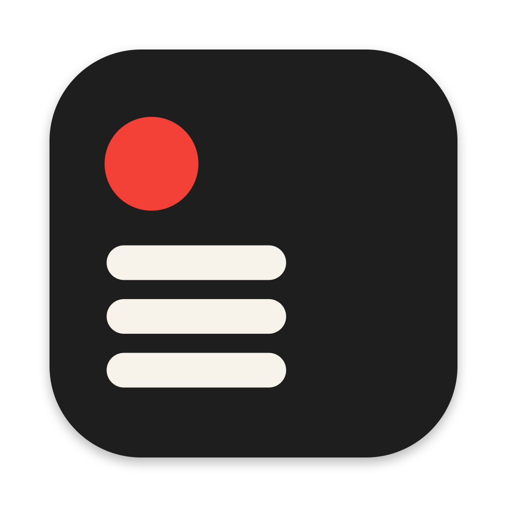
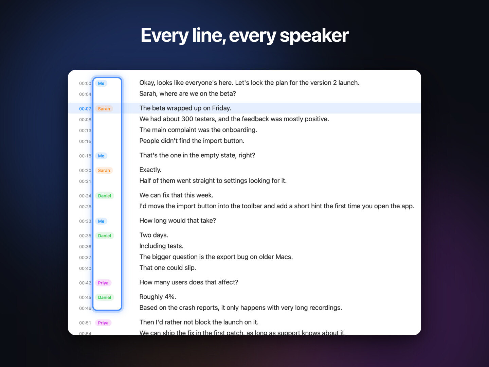
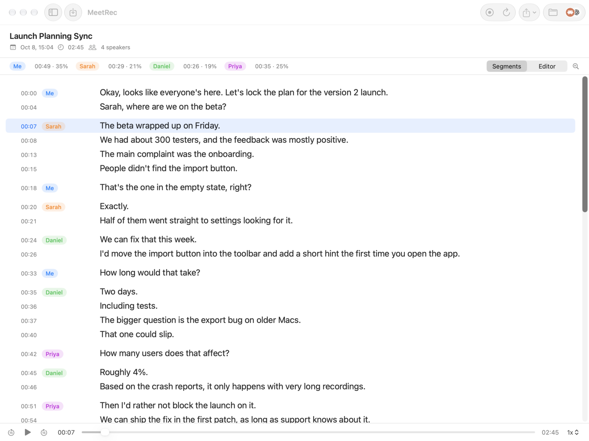
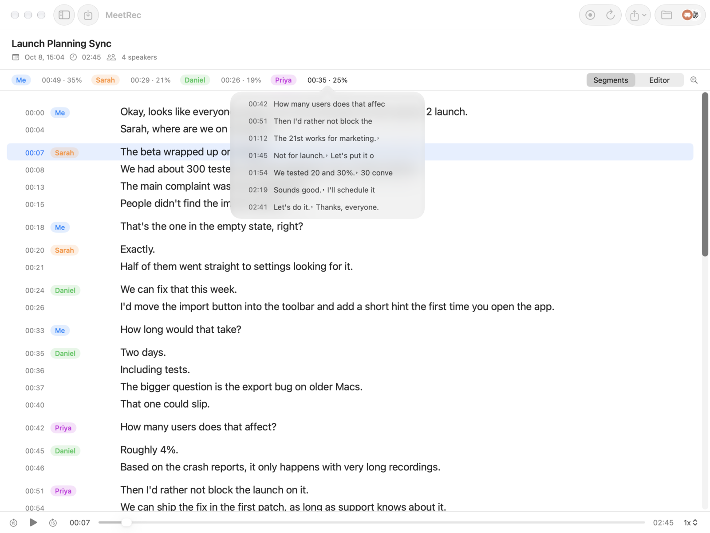
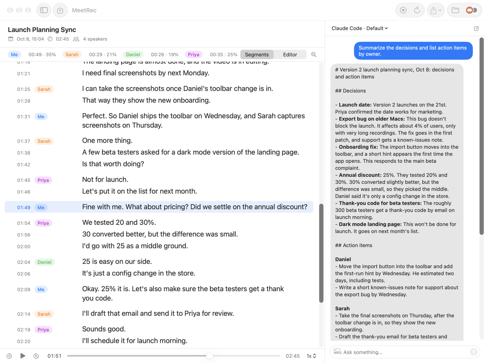
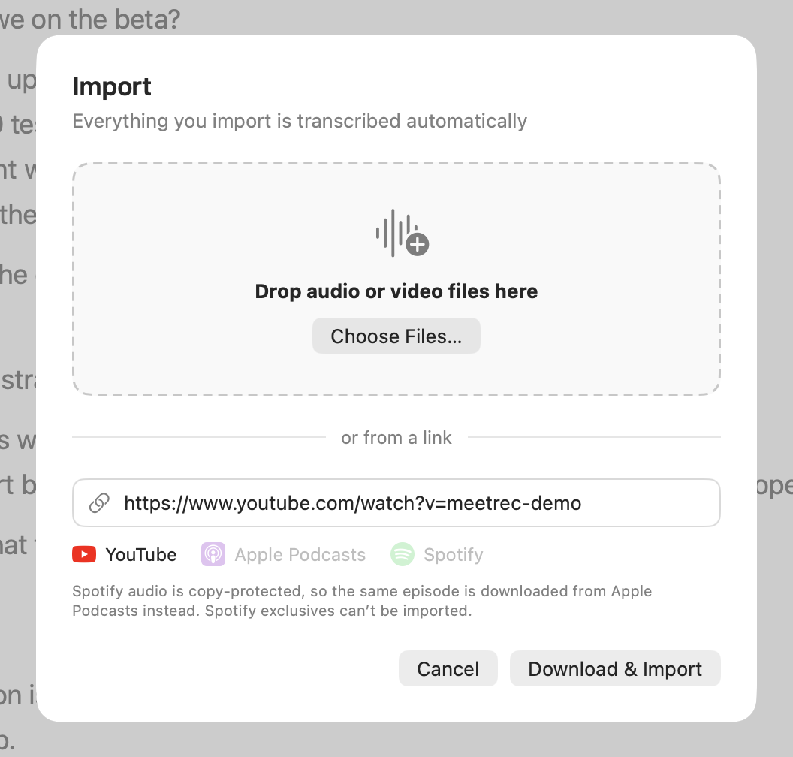
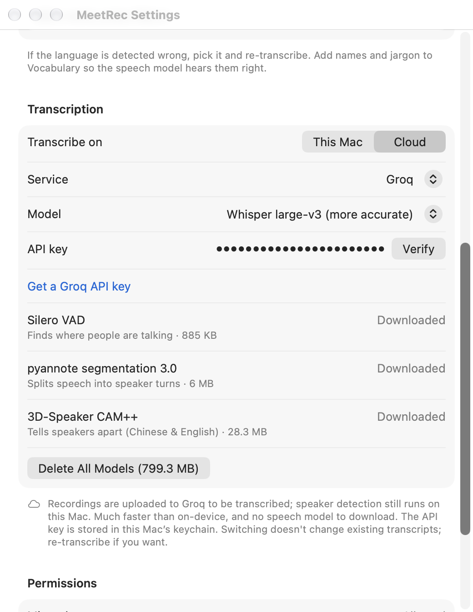

<div align="center">



# MeetRec

Meeting recorder for the macOS menu bar. Records, transcribes, and knows who said what.

[**Download**](https://github.com/t42ji2ji/meetrec/releases/latest) · [Website](https://meetrec.dorara.app) · [中文](#中文) · [English](#english)

  

<a href="https://meetrec.dorara.app/#video"></a>

[▶ Watch the 80-second intro](https://meetrec.dorara.app/#video)

</div>

## 中文

MeetRec 待在選單列上。瀏覽器開始用麥克風（Google Meet、Teams 等網頁會議）或 Slack huddle 開始時，它會問你要不要錄；錄完自動轉成逐字稿，並分出誰說了哪句。預設全部在你的 Mac 上處理，錄音不會離開這台電腦。

### 分得出誰說了什麼

你的麥克風和會議裡其他人的聲音分開錄，存成立體聲：左聲道是你，右聲道是對方。轉成逐字稿後再用說話者辨識把每一句標上是誰講的，名字可以直接改成真名。



### 點一個人，看這個人整場的發言

說話者統計會列出每個人講了多久。點某個人的時長，就會展開這個人每一段發言的開始時間和開頭幾個字；點任何一段，播放就跳到那裡。想找主管那句話是怎麼說的，不用從頭聽。



### 直接用你已經在用的 AI

電腦上裝了 [Claude Code](https://code.claude.com/docs/en/setup) 或 [Codex](https://developers.openai.com/codex/cli)，就能在側欄跟 AI 討論這場會議：整理重點、列待辦、追問細節。用的是你自己登入的帳號，不用另外申請 API key。按 ⌘E 開關側欄。



### 匯入檔案或貼上連結

不只會議。把音檔或影片拖進來，或貼上 YouTube、Podcast（Apple Podcasts 和其他 yt-dlp 支援的網站）、Spotify 單集的連結，MeetRec 會把聲音抓下來，一樣轉成逐字稿、分出說話者。Spotify 的集數會改到 Apple Podcasts 找同一集，Spotify 獨家節目沒辦法匯入。



### 其他功能

- 用 whisper.cpp 在本機轉錄，中英文自動偵測，也能指定語言；中文可選繁體或簡體
- 三種語音模型：small、large-v3-turbo（預設）、large-v3，選了才下載
- 常用詞：放人名、產品名、行話，幫模型聽對
- 換了模型或語言，可以挑模型重新轉錄
- 點逐字稿任一句跳到那個時間播放；「逐句」和「編輯」兩種檢視，直接改字
- 尋找並取代、搜尋所有錄音、調整字級、匯出 SRT／TXT
- 介面中英雙語，跟隨系統，也能在 app 裡切換

### 安裝

從 [Releases](https://github.com/t42ji2ji/meetrec/releases/latest) 下載 `MeetRec-<版本>.dmg`，打開後把 MeetRec 拖進「應用程式」。

### 系統需求

- macOS 15 以上
- Apple Silicon（M 系列晶片）
- 本機轉錄第一次會從 Hugging Face 下載語音模型：預設的 large-v3-turbo 約 570 MB，small 約 190 MB，large-v3 約 1.1 GB

### 權限

- **麥克風**：錄你的聲音
- **錄製系統音訊**：錄瀏覽器、Slack 裡其他人的聲音
- **自動化（瀏覽器）**：讀會議分頁的標題，用來替錄音命名；不給也能錄

### 雲端轉錄（選用）

不想下載模型、或想轉得更快，可以在設定裡改用 Groq 或 OpenAI 的雲端轉錄，填入你自己的 API key 就好。上傳前會先剪掉沒人講話的片段，省流量也省額度；分辨說話者仍然在本機做。API key 存在 macOS 鑰匙圈。



### 隱私

錄音存在 `~/Music/會議錄音`。預設情況下錄音、轉錄、說話者辨識都在本機執行。只有以下情況會連網：

- **下載模型**：第一次轉錄時從 Hugging Face 下載語音和說話者辨識模型
- **雲端轉錄**：只有在你開啟時，錄音才會上傳到你選的服務（Groq 或 OpenAI）
- **AI 對話**：你使用側欄時，逐字稿會透過你自己登入的 Claude Code 或 Codex 送到 Anthropic 或 OpenAI
- **從網址匯入**：下載你貼上的連結的音訊，第一次用時會先下載 yt-dlp

錄音前請先取得與會者同意，並遵守當地法律。

### 從原始碼編譯

需要 Xcode command line tools 和 cmake。

```sh
./vendor.sh   # 下載並編譯 whisper.cpp（whisper-cli、whisper-vad）和 sherpa-onnx
./build.sh    # 編譯 app 並裝到 ~/Applications
```

`build.sh` 和 `release.sh` 裡的簽名身分是作者的，自己編譯時換成你的。

### 授權

GPL-3.0。內附的元件和模型各自沿用原本的授權，見 `Resources/licenses`。

## English

MeetRec lives in your menu bar. When your browser starts using the microphone (Google Meet, Teams and other web meetings) or a Slack huddle starts, it asks whether to record. Afterwards it transcribes the recording and labels who said each line. By default everything runs on your Mac and the audio never leaves it.

### Knows who said what

Your microphone and the other participants are recorded separately into one stereo file: you on the left channel, them on the right. After transcription, speaker detection labels every line with who said it, and you can rename speakers to their real names.


### Click a person, see their whole timeline

The speaker summary shows how long each person talked. Click someone's talk time to list every one of their turns, with its start time and opening words; click a turn and playback jumps right there. No need to scrub through the whole meeting to find what your manager said.


### Works with the AI you already use

If [Claude Code](https://code.claude.com/docs/en/setup) or [Codex](https://developers.openai.com/codex/cli) is installed, discuss the meeting with AI in a side panel: summarize it, pull out action items, ask follow-up questions. It uses your own signed-in account, so there is no extra API key to set up. Press ⌘E to toggle the panel.


### Import files and links

Not just meetings. Drag in audio or video files, or paste a YouTube, podcast (Apple Podcasts and other sites yt-dlp supports) or Spotify episode link. MeetRec downloads the audio and transcribes it with speakers separated, same as a recording. Spotify episodes are fetched from the same episode on Apple Podcasts, so Spotify-exclusive shows can't be imported.


### More features

- Transcribes on your Mac with whisper.cpp, detecting Chinese or English automatically, or set the language yourself; Traditional or Simplified Chinese output
- Three speech models: small, large-v3-turbo (default) and large-v3, each downloaded only when you pick it
- Vocabulary: add names, product names and jargon so the model hears them right
- Re-transcribe a recording with a model of your choice
- Click any line to jump there in playback; switch between a per-line view and an editor view to fix text directly
- Find and replace, search across recordings, adjustable text size, export to SRT or TXT
- Interface in English and Chinese, following the system language or switched inside the app

### Install

Download `MeetRec-<version>.dmg` from [Releases](https://github.com/t42ji2ji/meetrec/releases/latest), open it and drag MeetRec into Applications.

### Requirements

- macOS 15 or later
- Apple Silicon
- On-device transcription downloads a speech model from Hugging Face the first time: about 570 MB for the default large-v3-turbo, 190 MB for small, 1.1 GB for large-v3

### Permissions

- **Microphone**: records your voice
- **System audio recording**: records the other participants in the browser or Slack
- **Automation (browser)**: reads the meeting tab's title to name the recording; optional

### Cloud transcription (optional)

To skip the model download or get transcripts faster, switch to Groq or OpenAI in Settings and enter your own API key. Silence is trimmed before upload to save bandwidth and credits, and speaker detection still runs on your Mac. API keys are stored in the macOS keychain.


### Privacy

Recordings are saved to `~/Music/會議錄音`. By default, recording, transcription and speaker detection all run locally. MeetRec goes online only for:

- **Model downloads**: speech and speaker models from Hugging Face, the first time you transcribe
- **Cloud transcription**: only when you turn it on, recordings are uploaded to the provider you chose (Groq or OpenAI)
- **AI chat**: when you use the side panel, the transcript is sent to Anthropic or OpenAI through your own signed-in Claude Code or Codex
- **Importing from a link**: downloads the audio from the link you paste, fetching yt-dlp on first use

Get consent from participants before recording, and follow the laws where you are.

### Building from source

Requires Xcode command line tools and cmake.

```sh
./vendor.sh   # downloads and builds whisper.cpp (whisper-cli, whisper-vad) and sherpa-onnx
./build.sh    # builds the app and installs it to ~/Applications
```

The signing identities in `build.sh` and `release.sh` are the author's; replace them with yours.

### License

GPL-3.0. Bundled components and models keep their own licenses; see `Resources/licenses`.
